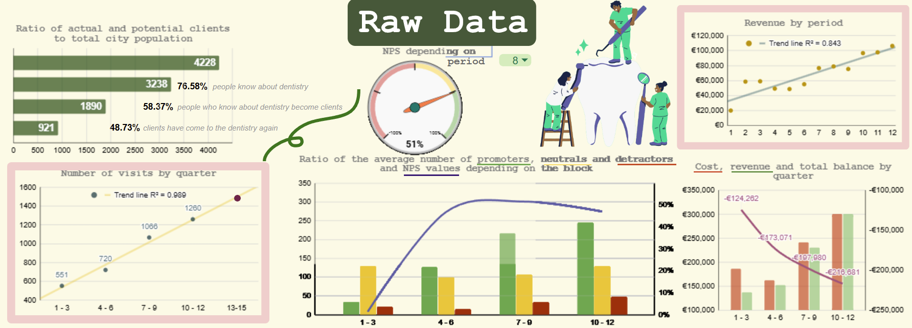
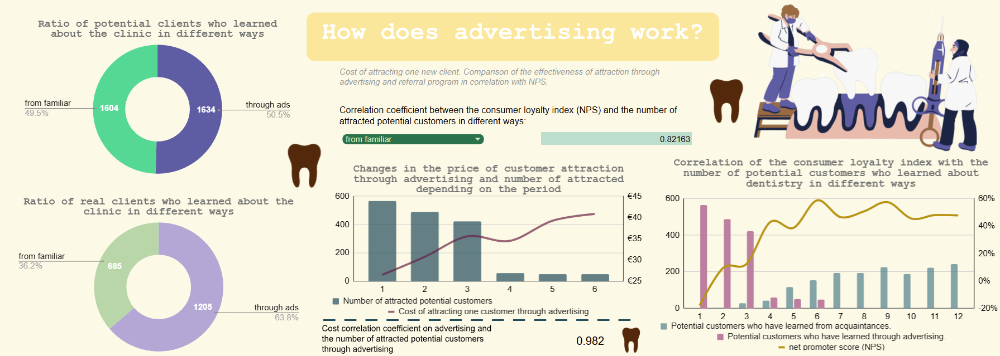
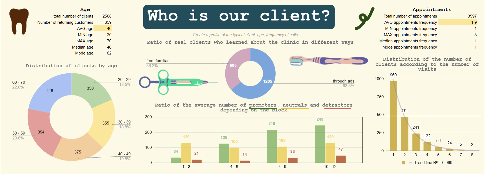
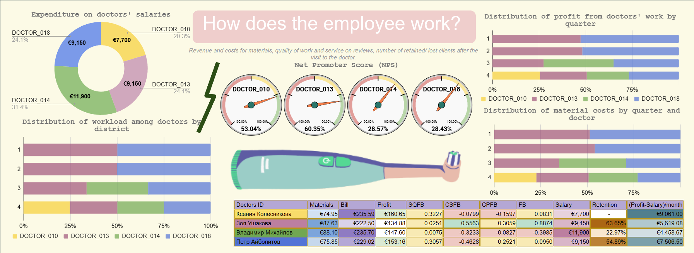
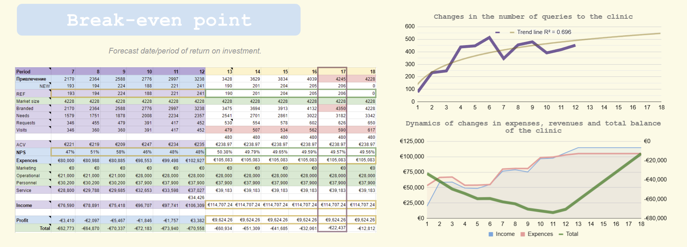
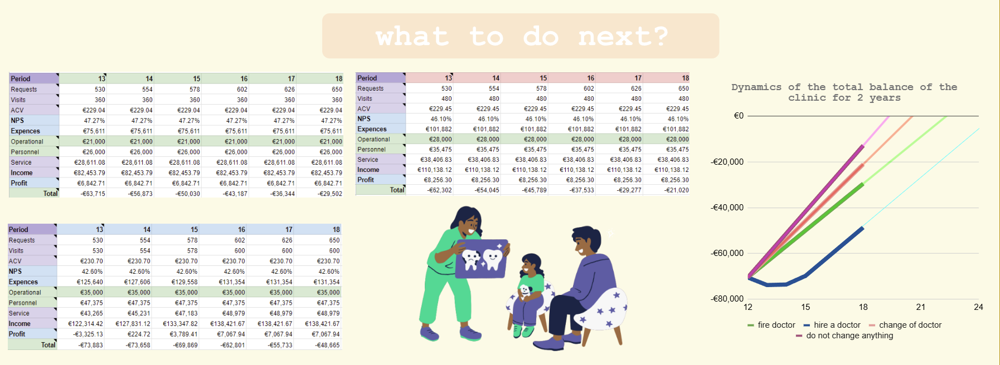
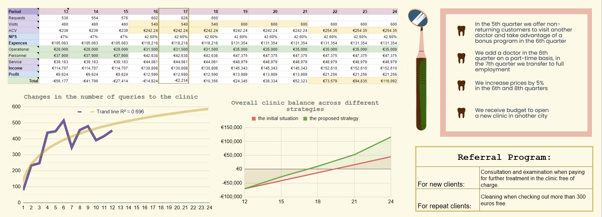

## The first project of the advanced training for Data Analysts:
### Dentistry Analytics
[check project on GSheets](https://docs.google.com/spreadsheets/d/1JDZaiACR47ddT4fbzs4cgjGkR9ZUDvXrsxAXPgry_9A/edit?usp=sharing)

**The main idea:**
>To build a fully transparent and dynamic financial-analytical model within Google Sheets. The primary goal was to move beyond simple LTV calculation, demonstrating a deep understanding of Unit Economics, cost attribution processes, and the precise calculation of the Payback Period for each customer cohort.

**Tasks:**
>Data cleaning and preparation from different tables.
>
>Creation of a descriptive statistics.
>
>Creation of an analytical statisctics.
>
>Break-even point research and implement a "what-if" function to assess the impact of changes in key variables (e.g., AOV) on the final Unit Economics.
>
>Create a clear, interactive dashboard in Google Sheets for monitoring metrics.

**Data cleaning and preparation:**
>Processed data from several tables (BRANDING 2.3, NEEDS 2.3, REQUESTS 2.3, VISITS 2.3).
>
>Filtered and removed irrelevant entries and duplicates.
>
>Added 'flag' values in several cases and additional meaningful columns.

**Creation of a descriptive statistics:**
>

**Creation of an analytical statistics:**
>During the development of these dashboards I answered various questions such as "advertising effectiveness", "client profile" and  "employee profile".
>
>
>
>
>
>

**Break-even point research and implement a "what-if" function:**
>Based on the descriptive statisctics, a forecast was made for the company provided that the current situation is maintained.
>
>
>
>Based on the analytical statisctics, hypothese were proposed and checked.
>
>
>
>Based on results, proposal were formulated with particular steps.
>
>>

**Conclusion:**

As a result of this project, I successfully identified key trends, relationships, and the impact of marketing efforts on business performance.
I calculated and visualized key business metrics.
My work provided actionable insights into business effectiveness, and highlighted key factors influencing deal outcomes.
