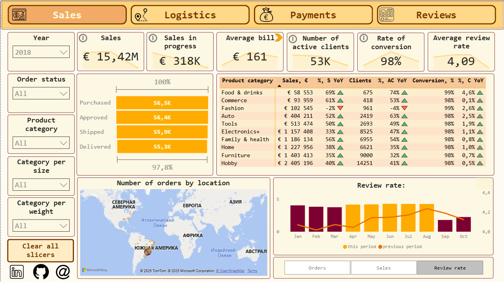
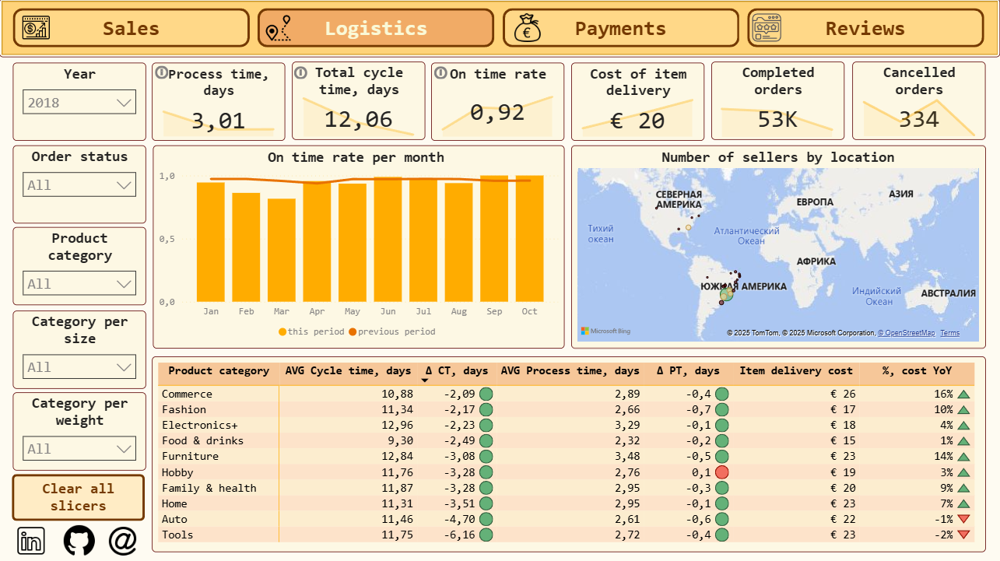
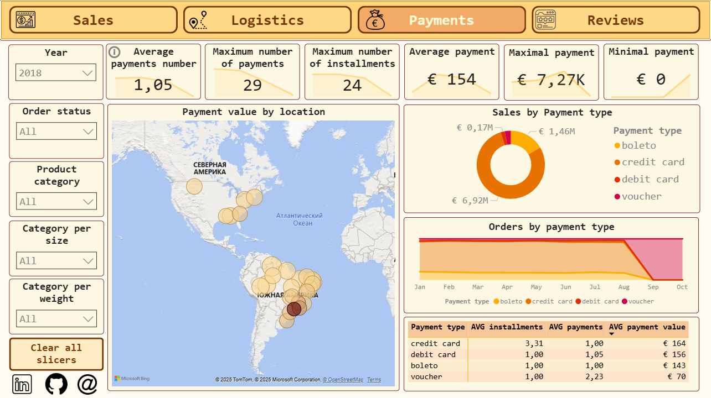
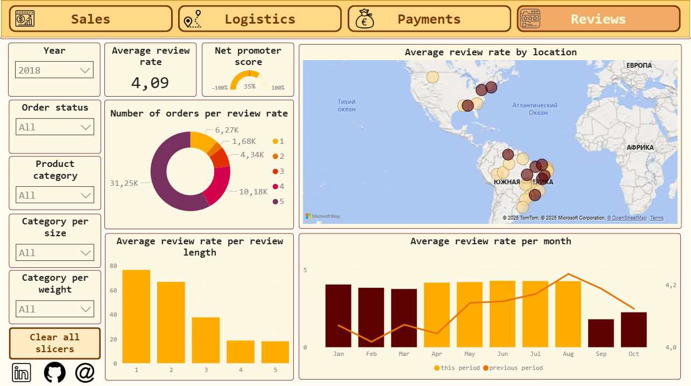

## The third project of the advanced training for Data Analysts:
### Marketplace Analytics
[check project on GDrive](https://drive.google.com/file/d/1PjI6opHB72Ubd3ySeU5KQGEP815hbnDp/view?usp=sharing)

**The main idea:**
>To build a fully understandable and self-contained BI report and dashboard from a dataset.

**Tasks:**
>Data Preparation and Transformation
>
>Analytical Engine Development (DAX)
>
>Visualization and Analysis

**Data Preparation and Transformation:**
>Dataset Integration: Combining multiple raw datasets into a unified model.
>
>Data Cleansing: Identifying and handling missing values, duplicates, and inconsistencies.
>
>Type Management: Performing necessary data type transformations to ensure correct analytical operations (e.g., date formats, numerical conversion).

**Analytical Engine Development (DAX):**
>Calculation of key business metrics (KPIs) using advanced DAX formulas.
>
>Development of calculated columns and measures to facilitate time-series analysis and forecasting.

**Analytical Engine Development (DAX):**
>Data visualization and analysis of indicator dynamics over time.
>
>Implementation of advanced visual features, including custom Report Page Tooltips for enhanced interactive data exploration.

>
>
>
>
>
>
>

**Conclusion:**

As a result of this project, I successfully created a comprehensive set of analytical dashboards and presentation-ready materials. 
Such a presentation can be used at corporate events, but also for large audiences like medical conferences.
The dashboard uses a large font size and minimal graphics per slide, making it ideal for large-scale projector display in big halls or for investigation on your own.
